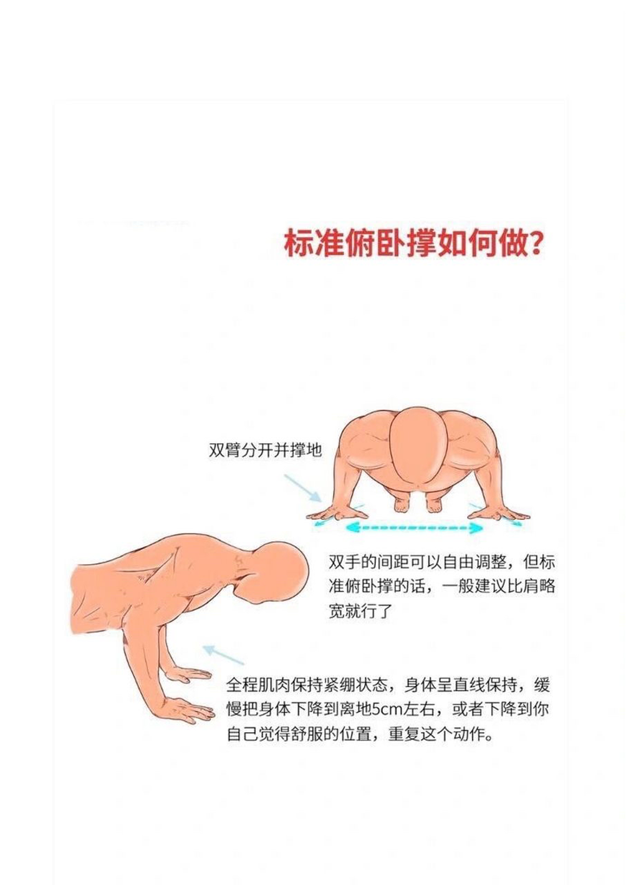
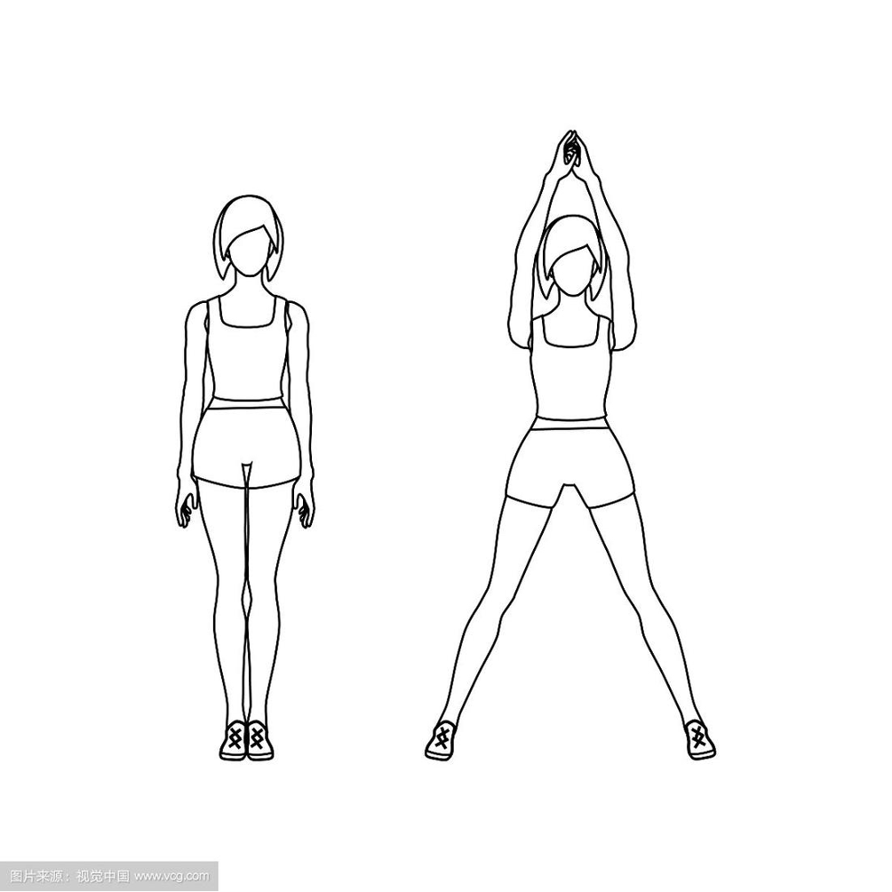
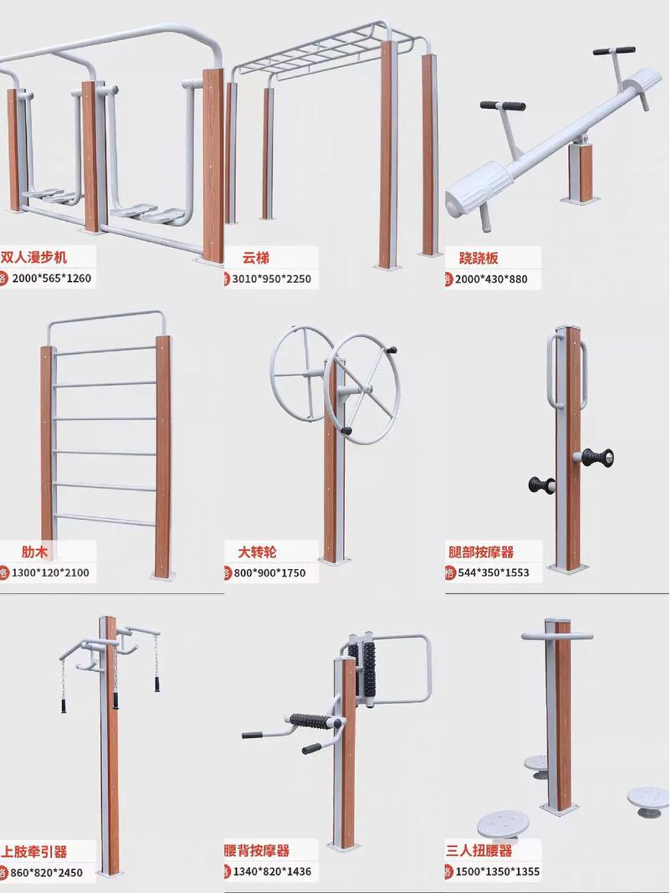

## 宿舍健身攻略：分享简单的锻炼方式和健身运动，适合学生时间和场地限制

### 1. 俯卧撑
1. 双手撑地，双脚并拢，身体挺直。
2. 慢慢弯曲肘关节，身体向下，直到胸部接近地面。
3. 用力撑起身体，回到起始位置。

健康分析：锻炼胸部、三头肌和核心肌群。

### 2. 跳跃运动

1. 原地跳跃或使用跳绳。
2. 跳跃时，双脚同时离开地面，尽量跳得高。
3. 落地时，膝盖微弯，减轻冲击力

健康效果：提高心率和增强下肢力量。

## 周锻炼计划：帮助学生保持动力和目标

1. 周一至周五，每天进行30分钟的有氧运动，如跑步、跳绳或骑自行车。
2. 周六进行全身力量训练，如俯卧撑、仰卧起坐和深蹲。

## 健身器材选购指南：分析不同健身器材的使用方法和效果，以及家庭健身的建议

1. 哑铃
    - 步骤
        1. 选择适合自己体重的哑铃。
        2. 进行各种重量训练，如举重、推举等。
        3. 注意正确的姿势和呼吸方法，避免受伤。
    - 健康效果：适合进行重量训练，提高肌肉力量和耐力。
2. 瑜伽垫
    - 步骤：
        1. 选择适合自己体重的瑜伽垫。   
        2. 进行瑜伽、普拉提等伸展和柔韧性训练。
    - 健康效果：提高身体的柔韧性和核心稳定性，促进身心健康。
3. 跳绳：
    - 步骤：
        1. 选择适合自己体重的跳绳，进行有计划的锻炼，如跳绳计数、跳绳挑战等。
        2. 进行有氧运动，提高心率和燃烧脂肪。
    - 健康效果：提高心肺功能，增强下肢力量和耐力。
4. 跑步机：
    - 步骤：
        1. 选择适合自己的跑步机，进行有计划的锻炼，如跑步课程、跑步挑战等。
        2. 进行有氧运动，模拟户外跑步。
    - 健康效果：提高心肺功能，燃烧脂肪，塑造身材。

