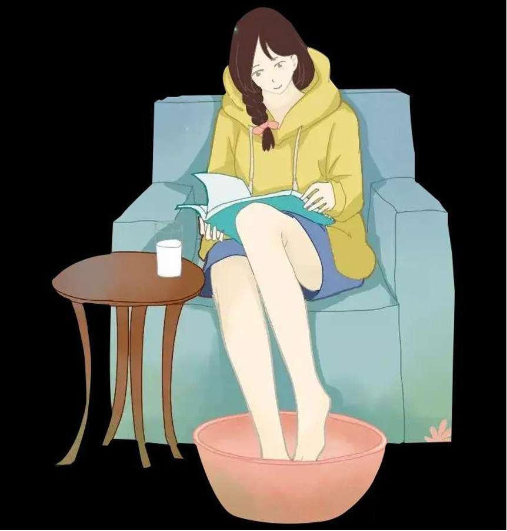

## 睡眠质量提升：改善睡眠的技巧和建议

1. 减少咖啡因和酒精的摄入：尤其是在睡前，避免饮用咖啡、可乐、某些茶和含酒精的饮料。

2. 睡前放松：可以通过阅读、听音乐或热水泡脚等方式放松身心，帮助入睡。

3. 睡前避免使用电子产品：手机、电脑等屏幕发出的蓝光可能会抑制褪黑激素的分泌，影响睡眠。

## 人际关系与沟通：如何建立和维护健康的社交关系

1. 积极参与社交活动：加入兴趣小组、俱乐部或参加社区活动，这些都是结识新朋友的好机会。

2. 尊重个人界限：了解并尊重他人的界限，不要过度侵入。

3. 解决冲突：当出现分歧时，通过有效的沟通技巧解决冲突，而不是回避。

## 休闲活动推荐：适合学生的休闲活动，如户外运动、旅游、阅读

1. 徒步旅行：徒步旅行是一种既经济又健康的休闲方式，适合喜欢探索自然的学生。可以选择附近的国家公园或自然保护区进行短途徒步，不仅能锻炼身体，还能放松心情，欣赏美景

2. 骑行：骑自行车是一种环保的出行方式，也是很好的休闲活动。可以利用周末时间，邀请朋友一起骑行，探索新的路线和地区，同时锻炼身体。

3. 音乐和舞蹈：参与音乐或舞蹈活动，不仅能够培养艺术修养，还能在忙碌的学习生活中找到乐趣。加入学校的乐队、合唱团或舞蹈团，也可以自己学习乐器或舞蹈。

