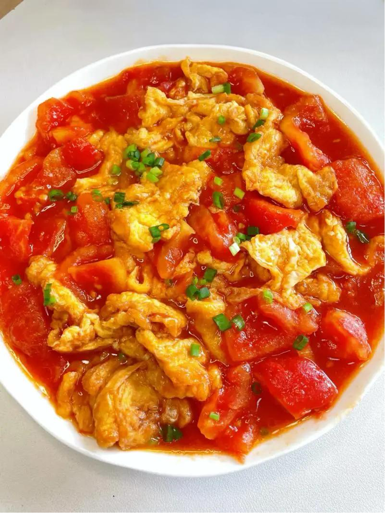
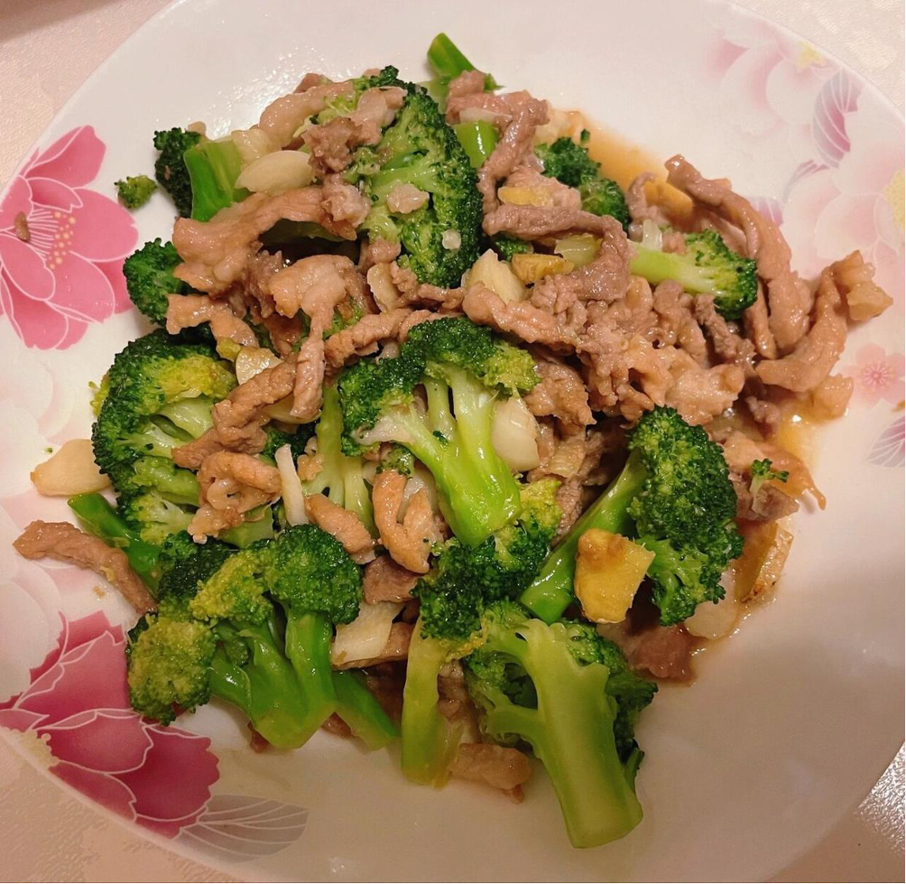
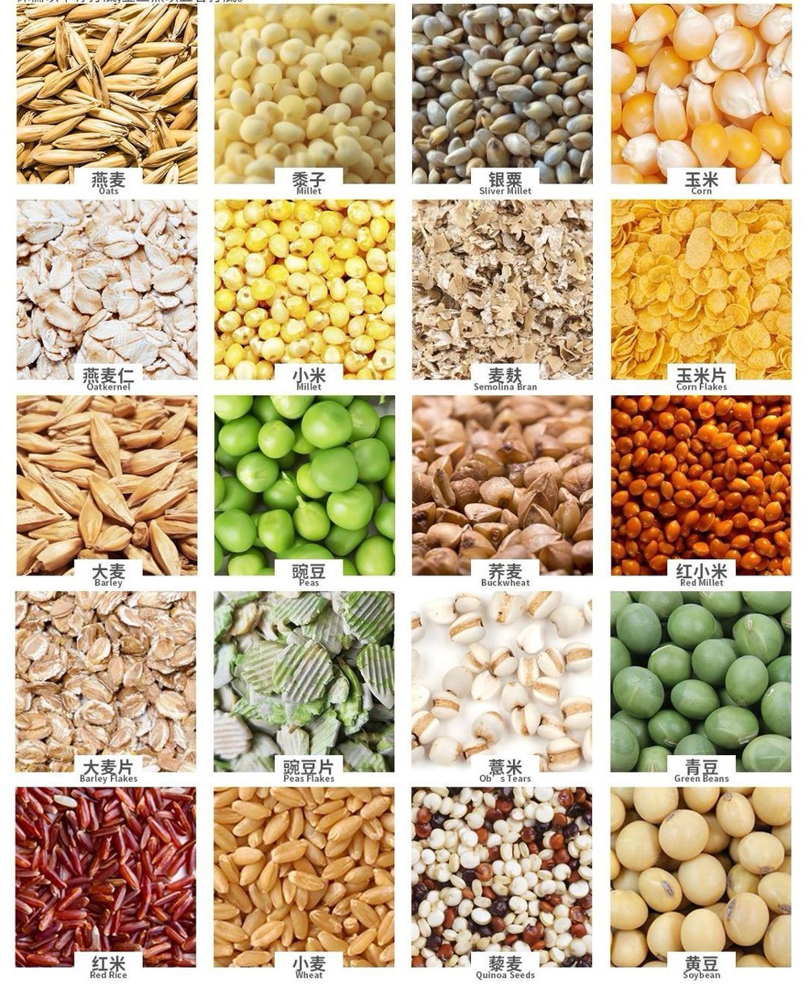
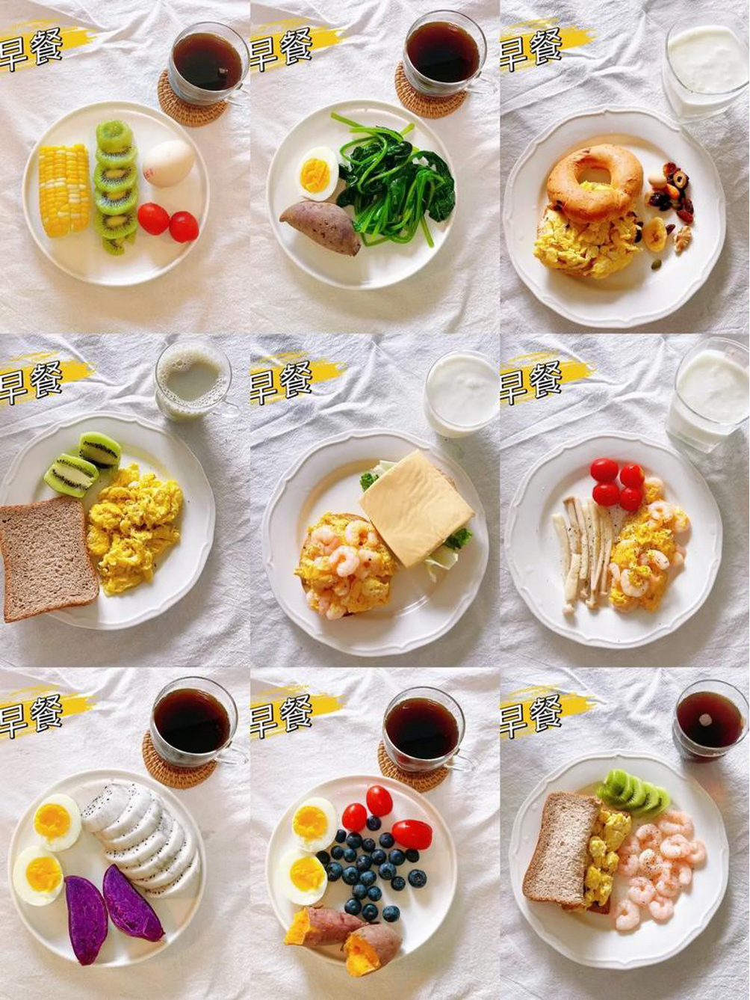
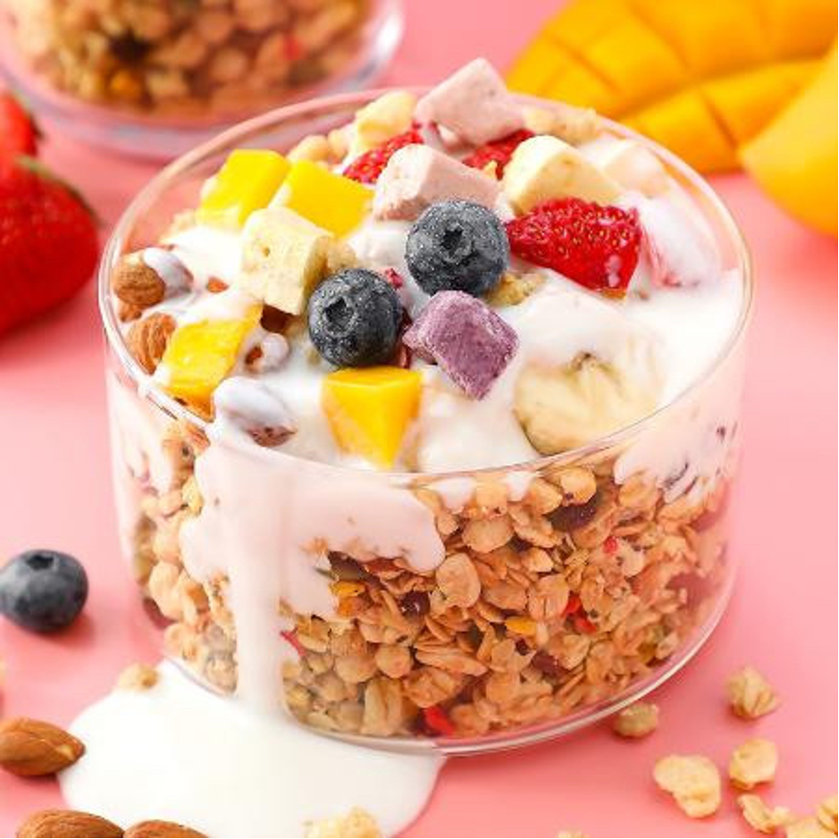

## 宿舍快手菜：简单易做的健康食谱，适合宿舍条件

1. 番茄炒蛋
- 材料：鸡蛋2个、番茄1个、盐适量、油适量
- 步骤：1. 鸡蛋打散，番茄切块。2. 锅中放油，倒入鸡蛋液，炒至凝固后盛出。3. 锅中再放油，加入番茄块翻炒至出汁。4. 加入炒好的鸡蛋，加盐调味，翻炒均匀即可。
- 营养分析：富含蛋白质、维生素C和番茄红素，有助于增强免疫力。

2.西兰花炒肉
- 材料：西兰花150克、猪肉100克、盐适量、油适量、蒜末适量
- 步骤：1. 西兰花洗净切小朵，猪肉切丝。2. 锅中放油，加入蒜末炒香。3. 加入猪肉丝翻炒至变色。4. 加入西兰花，加盐调味，翻炒均匀即可。
- 营养分析：富含膳食纤维、维生素C和蛋白质，有助于提高新陈代谢。

## 食材小百科：分析常见食材的营养价值和健康益处

1.燕麦
- 营养分析：富含膳食纤维、维生素B1和B2，有助于调节血糖和促进肠道健康。
- 食用建议：早餐时，可以加入牛奶或豆浆中，搭配水果和坚果，制成美味的燕麦粥。
2.豆腐
- 营养分析：富含优质蛋白质、钙和铁，有助于增强体质和预防骨质疏松。
- 食用建议：豆腐可以搭配蔬菜和肉类，制成各种美味的菜肴，如麻婆豆腐、红烧豆腐等。

## 学生饮食指南：提供饮食建议，针对学生常见问题和需求。

1.考试周的饮食安排
- 建议：考试周期间，增加蛋白质摄入，如鸡肉、鸡蛋和豆腐，以及富含维生素C的食物，如柑橘类水果和草莓，以提高免疫力。
- 饮食安排：早餐可以选择鸡蛋、牛奶和全麦面包；午餐和晚餐可以适量增加瘦肉、鱼类和豆制品，搭配蔬菜和水果。

2.熬夜学习的健康小吃
- 建议：选择低糖、低脂、高蛋白的小吃，如坚果、酸奶和水果
-饮食安排：晚上学习时，可以准备一些坚果和酸奶，作为健康的零食；熬夜学习后，可以吃一些新鲜水果，补充能量和营养。

