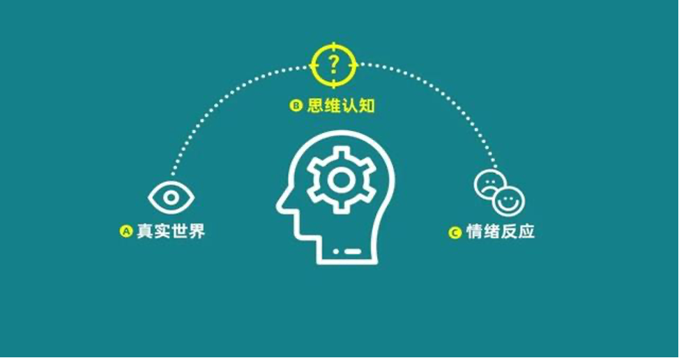
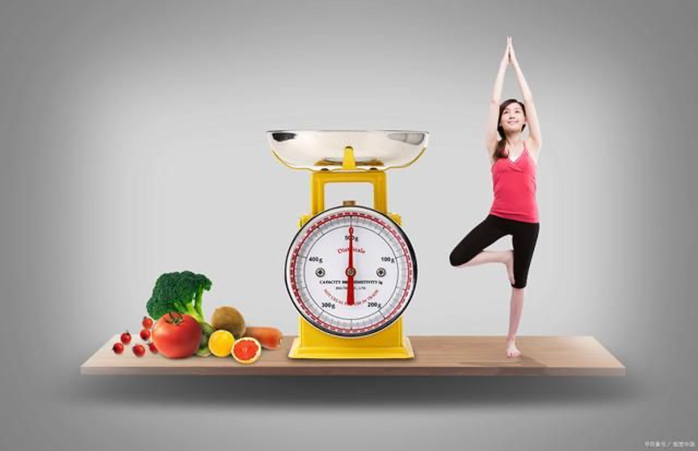
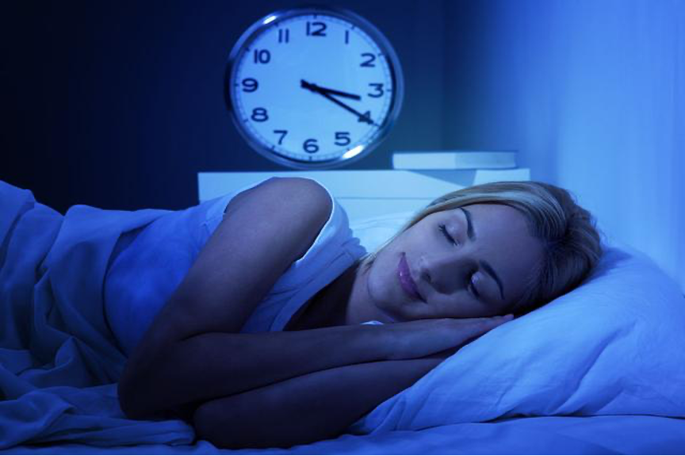
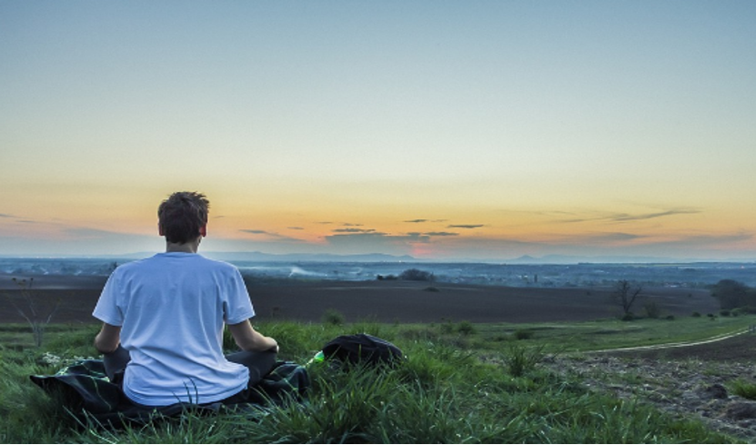
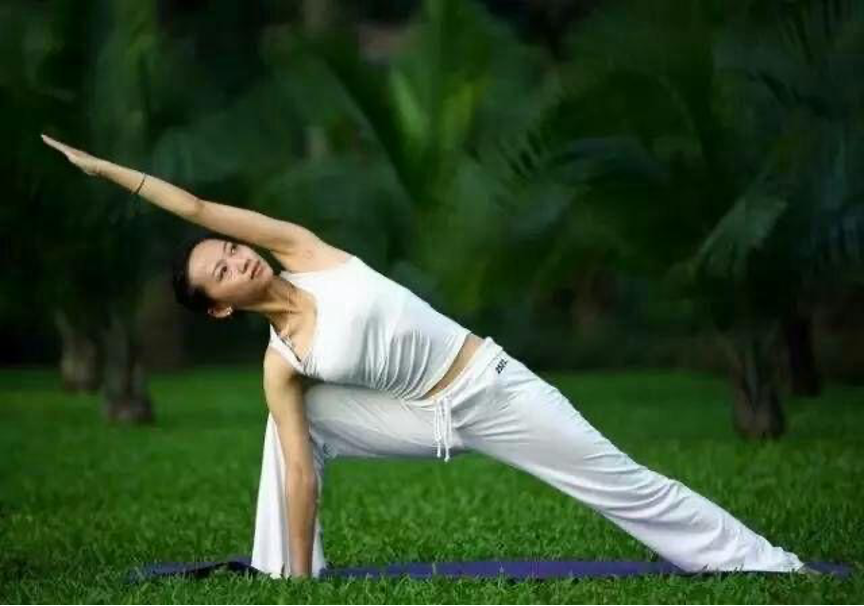
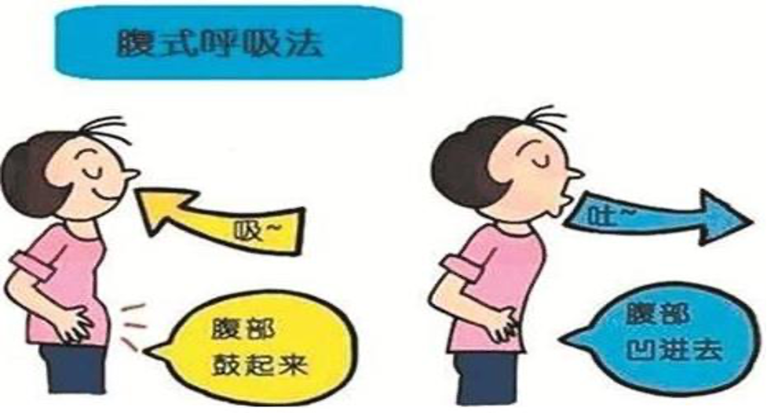
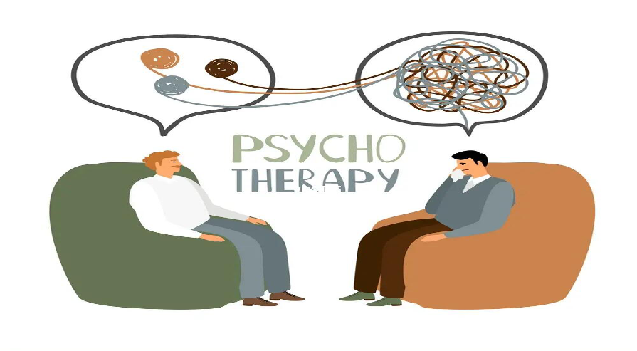

## 压力管理技巧：应对压力、焦虑和情绪管理的技巧

### 1. 认知行为疗法 (CBT)

CBT的核心是认识到我们的思维、情感和行为之间存在密切的联系。通过这种疗法，可以学习如何识别“自动思维”（即无意识的、习惯性的负面思维），并挑战它们的有效性。例如，当感到焦虑时，可能会自动地认为“我做不到”，但通过CBT，可以学习如何用更现实和积极的方式来重新评估这种情况。

### 2. 锻炼和健康饮食

锻炼释放内啡肽，这是一种天然的化学物质，可以提高心情并减少疼痛。均衡的饮食确保身体获得所需的营养，从而保持身体和心理的健康。

### 3. 睡眠充足

睡眠对于恢复身体和大脑功能至关重要。要确保自己的睡眠环境舒适、黑暗和安静，同时避免在睡前使用电子设备。

## 简单冥想与放松：简单的冥想、瑜伽和呼吸练习等放松方法

### 1. 冥想

选择一个安静的地方，采取舒适的姿势，可以选择坐在地上，用垫子支撑，或坐在椅子上，保持背部挺直，闭上眼睛集中注意力，深深地吸气，然后慢慢地呼气，将注意力集中在一个特定的对象、声音或自己的呼吸上。当发现自己的思维开始游离时，再轻轻地将其引导回到焦点上。初学者可以从5分钟开始，逐渐增加时间。

### 2. 瑜伽

1. 山式 (Tadasana)
站立，脚跟轻轻触碰，脚趾稍微分开，双手自然下垂，手掌面向身体，吸气时，伸直手臂，掌心向上，呼气时，慢慢放下手臂。
2. 下犬式 (Adho Mukha Svanasana)
从四足着地的姿势开始，吸气，抬起臀部，形成一个倒V形，手掌和脚掌紧贴地面，头部放松，保持几次呼吸，然后慢慢放下臀部回到四足着地的姿势。
3. 树式 (Vrksasana)
从山式开始，将一只脚的底部放在另一只腿的大腿上，双手合十在胸前，或者伸直手臂向上，保持平衡，深呼吸几次。

### 3. 呼吸练习

1. 腹式呼吸
坐下或躺下，手放在腹部，深深地吸气，感觉腹部上升，慢慢地呼气，感受腹部下降。
2. 4-7-8呼吸法
完全呼气，然后通过鼻子静静地吸气计数到4，屏住呼吸计数到7，完全通过嘴巴呼气计数到8，重复此循环四次。
3. 蜂鸣呼吸 (Bhramari Pranayama)
闭上眼睛，用双手轻轻盖住耳朵，深深地吸气，然后慢慢地呼气，同时发出像蜜蜂一样的嗡嗡声，继续这个呼吸和声音的节奏，至少5次。

## 心理咨询服务：心理咨询服务的信息和预约方式

1. 心理咨询服务：西北民族大学心理健康中心
个人咨询：针对焦虑、抑郁、压力管理、自尊、人际关系等问题。
情侣咨询：解决沟通障碍、信任问题、冲突解决等情侣间的挑战。
家庭咨询：帮助家庭成员改善关系，解决冲突，增强家庭凝聚力。
职业咨询：职业规划、职场压力、工作与生活平衡等。

2. 预约方式
  1. 在线预约
访问官方网站：https://jinshuju.net/f/nLBOIL
  2. 电话预约
拨打预约热线：0931-2927955或0931-4512955
  3. 电子邮件预约
发送电子邮件至nwmupsy@126.com，说明希望的服务类型、首选日期和时间，以及联系信息。

